# Mines Data Platform — ELT Framework: Technical Design + Runbook

> **Audience:** the data engineer onboarding to this platform.
> **Status:** Bronze, Silver (registry-driven, all landed tables), and the Gold DAG builder (dim_permit + fact_permit_amendment) are built and running. This document is the end-to-end design **and** the operational runbook.
> **Companion doc:** `02-SOURCE-DATA-and-GOLD-MODEL.md` (source schema findings + the proposed dimensional model).
> **Living record:** `medallion/WORKLOG.md` is the chronological build log (decisions, findings F1–F12+, every deploy). Read it alongside this.

---

## 1. What this platform does (one paragraph)

It turns the **MDS** (Mines Digital Services, BC) operational Postgres database into a governed **medallion** analytics platform on **Microsoft Fabric**: raw → **Bronze** (immutable history) → **Silver** (cleansed, deduplicated, DQ-checked current state) → **Gold** (curated star-schema dims/facts for Power BI / T-SQL). Everything below Bronze is **metadata-driven** from control tables in the Fabric **Warehouse**, so adding tables/dims/facts is configuration, not new code.

---

## 2. Environment & access model (read this first — it explains every workaround)

| Resource | Name / id |
|---|---|
| Fabric workspace | `mines-data-platform-fabricws-dev-1` = `8f380f88-5ce5-48d1-9fa5-fbbfbe2685a0` |
| Bronze lakehouse | `mines_data_platform_lh1` = `8cd34a44-500a-47d9-aa2d-5ad0c2149858` |
| Silver lakehouse | `lh_silver` = `a0190e0e-c2f5-4740-ab90-a2f29b6e6991` |
| Gold lakehouse | `lh_gold` = `5e43f78b-2156-4469-980e-bffda0295fac` |
| Warehouse | `mines-data-platform-fabwh1` = `9ed9a608-33e5-408b-bd51-adc2dad1e7ab` |
| Source DB connection | `mcm-mdscore-postgresql-dev` = `21b383a1-c561-4540-980d-ce3683e89236` (PostgreSQL) |
| Warehouse connection | `warehouse-mines-data-platform` = `586bcc06-4cf2-4a33-93c0-f1d1b4cd9420` (SQL) |

### 2.1 Topology at a glance

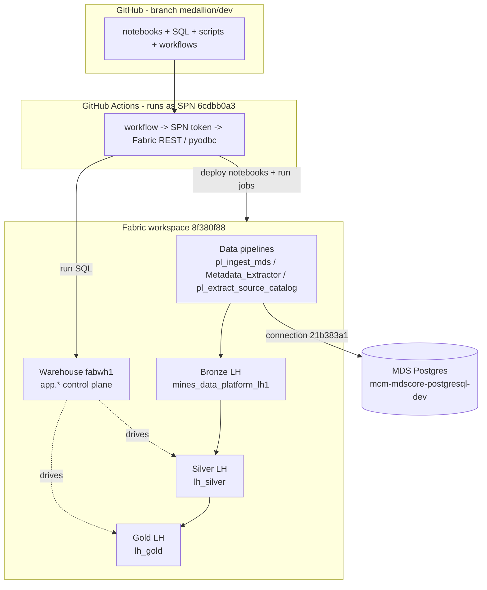

### 2.2 How a deploy/run actually happens

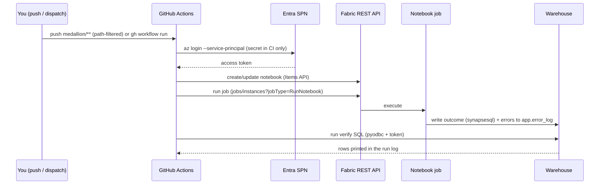

**Why we deploy via GitHub Actions + a Service Principal (not the Fabric UI or local CLI):**
- The gov.bc.ca tenant enforces **Conditional Access** that blocks interactive `az login` / device-code for our accounts. So **all** automated actions run as a **Service Principal (SPN, client `6cdbb0a3-…`)** whose secret lives **only** in GitHub Actions secrets (`AZURE_CLIENT_ID/SECRET/TENANT_ID`). We never hold the secret locally.
- We **deploy directly to the workspace** via the Fabric REST **Items API** and **do not sync this branch into the team's Fabric Git integration** (github↔Fabric sync is painful and would fight the team's pipeline). Think of yourself as a Fabric developer working *in* the workspace; the git branch `medallion/dev` is our **source-of-truth + deploy vehicle**, not a Fabric-synced folder.
- Consequence: the repo's folder layout is **ours**; Fabric workspace items are flat and addressed by **display name**. (We separately mirror folders in the workspace UI via `organize_folders.py` — cosmetic only.)

**Identity caveats (see `fabric-access-and-identity` memory):** our GitHub account is `ServiceBC` (gov account). Branch off the **live feature branch** `feature/mines_dataplatform_dev`; work on `medallion/**` branches (a push to `feature/**` auto-creates an orphan workspace — avoid).

---

## 3. Repository layout

```
Fabric/
  Notebook/                              # OUR notebooks (workspace items are flat; folders are repo-only)
    nb_bronze_load.Notebook              # Bronze: raw parquet -> bronze.* (append-only)
    nb_silver_registry.Notebook          # builds app.object_registry + app.field_registry FROM SOURCE
    nb_silver_build.Notebook             # registry-driven Bronze -> Silver
    nb_gold_orchestrator.Notebook        # DAG-driven gold build (reads gold_build + gold_dependency)
    stageQuery/                          # gold transform notebooks (silver -> stg.<obj> materialized tables)
      nb_gold_tf_dim_permit.Notebook
      nb_gold_tf_fact_permit_amendment.Notebook
    utility/
      nb_util_gold.Notebook              # build_dimension() / build_fact() engine (%run by orchestrator)
      nb_util_paths.Notebook             # OneLake path helper (foundation)
    test/
      nb_gold_test.Notebook              # purposely tests update + soft-delete for dim & fact
      nb_smoke_foundation.Notebook       # foundation cross-lakehouse smoke test
  nb_bronze_master.Notebook, Nb_Silver_Master.Notebook   # TEAM-owned (left untouched at root)
  mines-data-platform-fabwh1.Warehouse/  # warehouse project (the team's committed DDL; not our deploy path)

medallion/
  WORKLOG.md                             # chronological build log + findings (READ THIS)
  docs/                                  # <- you are here
  sql/
    app_registry_tables.sql              # Fabric-safe DDL + seed for app.* control tables (DEPLOY TRUTH)
    run_sql.py                           # pyodbc + SPN access-token SQL executor (GO-split)
    adhoc.sql                            # scratch query, run via fabric-ops-adhoc-sql
    verify_*.sql                         # per-stage verification queries
  deploy/
    deploy_notebook.py                   # create/update + optionally run ONE notebook (Items API)
    deploy_notebooks.py                  # foundation deploy (util_paths + smoke)
    organize_folders.py                  # mirror repo folders into the workspace UI
    probe_pipeline.py                    # read-only: inspect Fabric data pipelines + connections
    clone_source_catalog.py              # clone Metadata_Extractor -> pl_extract_source_catalog
  handoff/adf-error-log-change.md        # handoff: route pipeline errors into app.error_log

.github/workflows/                       # one workflow per operation (see §6)
  scripts/                               # the bash each workflow runs
```

---

## 4. The control plane (Warehouse `app.*`)

The Warehouse is the **metadata brain**. Tables we own are built by `medallion/sql/app_registry_tables.sql` (idempotent, Fabric-safe). Tables the **team** owns feed us config.

| Table | Owner | Purpose |
|---|---|---|
| `object_registry` | us | one row per **source table**: bronze/silver schema+table, `load_type`, **`primary_key`** (true, possibly composite), `watermark_column`, `is_active`, priority, dependency. **Auto-built** by `nb_silver_registry`. |
| `field_registry` | us | one row per **column**: source `spark_type`, `nullable`, `is_pk`, `include_in_load`, ordinal. Auto-built. |
| `gold_build` | us | one row per **gold object**: `gold_object`, `object_type`, `transform_notebook`, `source_table`, `table_type`, **`load_strategy`**, `surrogate_key`, `business_keys`, `non_historized_columns`, `watermark_column`, `last_n_days`, `is_active`. |
| `gold_dependency` | us | the gold **DAG**: `node_name` + `depends_on` (comma list of parent node_names). |
| `dq_rule` / `dq_result` | us | data-quality rule definitions + run outcomes (framework present; rule engine is a **TODO**, see §9). |
| `error_log` | us | **centralized** errors for pipeline AND notebook, discriminated by `layer` (`bronze|silver|gold|ingest`). Includes SQL `TRY/CATCH` columns for other SQL-based writers. |
| `silver_load_state` | us | per-entity **incremental cursor**: `last_dl_load_ts` high-water mark. Silver reads only `dl_load_ts > cursor`. |
| `silver_settings` | us | `force_full_all` flag — set to 1 to force a full silver rebuild (self-clears after the run). |
| `gold_run_log`, `gold_test_log`, `silver_run_log` | us | per-run outcome tables (written by the notebooks for reliable SQL verification). |
| `pipeline_control` | **team** | the ingestion config: 255 rows, one per ingested table, with `source_entity`, `target_table`, `load_type`, `watermark_column`, `priority`, `dependency_on`. We **read** it to enrich `object_registry`. |
| `pipeline_log` | **team** | ingestion run history. Join `error_log.run_id = pipeline_log.run_id` for context. |
| `config`, `schema_registry` | team | operational config / layer descriptions. |
| `transform_registry` | legacy | superseded by `gold_build`/`gold_dependency`; left in place, unused by us. |

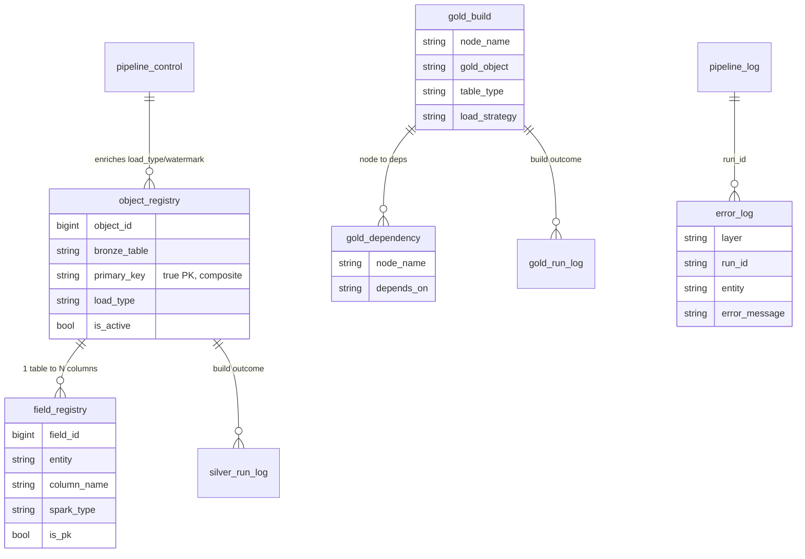

**Fabric Warehouse T-SQL constraints (learned the hard way — see findings F1–F4):** no `IDENTITY`, no `PRIMARY KEY`/constraint keyword in `CREATE TABLE`, no `DEFAULT`/`CHECK`/computed columns. Surrogate ids are writer-minted (GUID or `row_number()+max`). `sqlcmd -G` cannot auth as SPN — use `run_sql.py` (pyodbc + access token).

---

## 5. The pipeline, layer by layer

```mermaid
flowchart LR
  SRC[(MDS Postgres<br/>mcm-mdscore-postgresql-dev)]
  SRC -->|pl_ingest_mds (team)| RAW["Bronze Files/raw/*.parquet"]
  SRC -->|Metadata_Extractor (team)<br/>+ pl_extract_source_catalog (ours)| CAT["Bronze Files/raw/mds_source_catalog"]
  RAW -->|nb_bronze_load| BR["bronze.* (append-only)"]
  CAT -->|nb_silver_registry| REG["app.object_registry + field_registry"]
  BR  -->|nb_silver_build (registry-driven)| SV["silver.* + silver.v_*"]
  BR  -.DQ fail.-> Q["quarantine.*"]
  SV  -->|nb_gold_tf_* (stageQuery)| STG["stg.* (materialized)"]
  STG -->|nb_gold_orchestrator + nb_util_gold| GOLD["gold.dim_* / gold.fact_*"]
  REG -.drives.-> SV
  GB["app.gold_build + gold_dependency"] -.drives.-> GOLD
```

### 5.1 Source extraction (Fabric Data pipelines)
- **`pl_ingest_mds`** (team): copies MDS tables → `Files/raw/...` parquet, driven by `pipeline_control`. **Not ours; do not modify.**
- **`Metadata_Extractor`** (team): queries source `pg_catalog` for column metadata → `Files/raw/mds_core_meta.csv`, but **filtered to PK columns only**.
- **`pl_extract_source_catalog`** (OURS, `clone_source_catalog.py`): a **clone** of `Metadata_Extractor` with the PK-only filter removed and the sink repointed to `Files/raw/mds_source_catalog`. It lands the **full** per-column catalog (table, column, position, type, nullability, **is_primary_key / unique / foreign_key**, FK targets, comments). It **reuses the existing source connection** (`21b383a1`) — so we never needed Key Vault or network access. Originals untouched.

### 5.2 Bronze — `nb_bronze_load` (append-only, immutable)
Per landed parquet file: read (with `LEGACY` datetime/int96 rebase for pre-1900 dates) → skip if `bronze_file_name` already loaded (idempotency) → add control columns `dl_load_id, bronze_file_name, bronze_file_timestamp, bronze_load_date, dl_load_ts, dl_rowhash` → append to `bronze.{table}` partitioned by `bronze_load_date`. **No updates/deletes** — bronze is the immutable log. 228 tables currently landed.

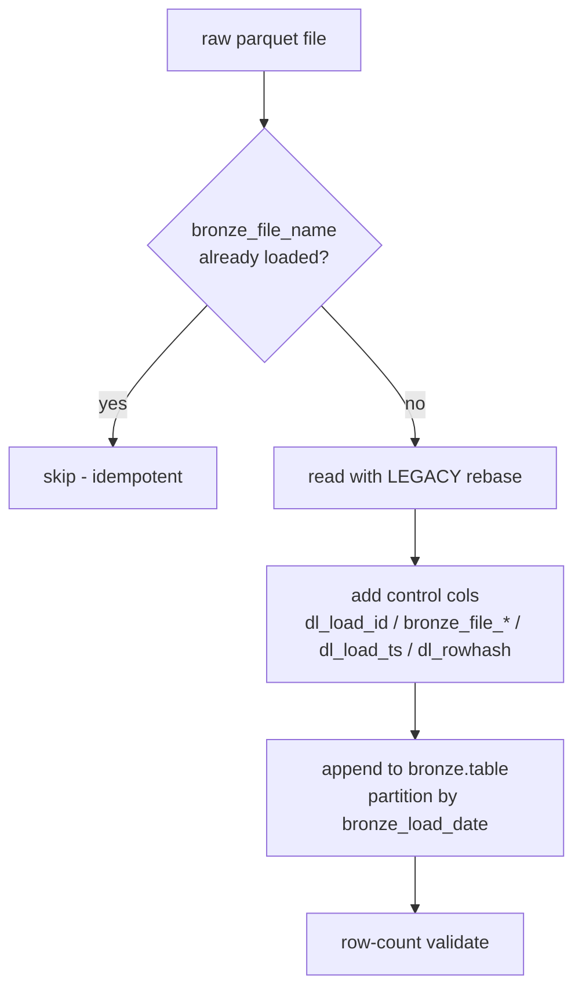

### 5.3 Registry — `nb_silver_registry` (FROM SOURCE, zero manual entry)
1. Reads `Files/raw/mds_source_catalog` (the pg_catalog dump) → **true PKs (composite where applicable)**, all columns, source types.
2. Enriches from `pipeline_control` for `load_type`/`watermark`/`priority`/`dependency` (these are **ingestion** facts, not source metadata).
3. Checks which tables actually **landed** in bronze.
4. Writes `object_registry` (one row/table) + `field_registry` (one row/column). **`is_active` = landed AND not an operational prefix** (`celery_`, `etl_`, `django_`, `auth_`, `spatial_ref`).

Current state: **354 source tables registered, 210 active; 3,362 fields.** Tables not landed (e.g. `mine`) are registered **inactive** with their correct source PK and auto-activate when they land — **no code change**. This is exactly the "park the unlanded ~29 business tables, build everything else" behaviour: it is automatic, driven by the landed check.

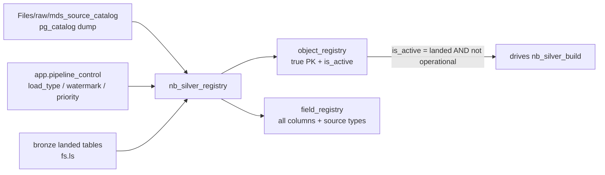

### 5.4 Silver — `nb_silver_build` (registry-driven, **incremental**)
Loops every **active** object from `object_registry`. Silver is **incremental**: a per-entity watermark `app.silver_load_state(entity, last_dl_load_ts)` records the high-water mark, and each run processes only the bronze **delta** (`dl_load_ts > cursor`). Per table:
1. **Read delta** — bronze rows with `dl_load_ts > cursor` (or *all* rows on a full run). Empty delta → `no-change`, skip.
2. **Standardize** names + **cleanse** (trim, `''`→`null`).
3. **Dedup (load_type-aware):** `INCREMENTAL`+true PK → latest row per **(composite) PK** by `dl_load_ts`; `FULL` → latest snapshot (`max(bronze_file_timestamp)`); no PK → `dropDuplicates`.
4. **DQ** — not-null on every PK column → valid vs **quarantine**.
5. **Write:** `INCREMENTAL`+PK incremental run → **MERGE upsert** by PK into `silver.{table}` (soft-deletes carry via `deleted_ind`); otherwise **overwrite** (full run, FULL snapshot, or no-PK). Drop bronze lineage, stamp `silver_load_ts`, refresh `silver.v_{table}`.
6. **Advance the cursor** (only on success) and write `app.silver_run_log`.

**A full run** happens when `app.silver_settings.force_full_all = 1` (self-clearing escape hatch for hard-deletes / drift), when an entity has no cursor yet, or when its silver table is missing. The **first** run after the refactor is full (establishes the cursor); subsequent runs are incremental.

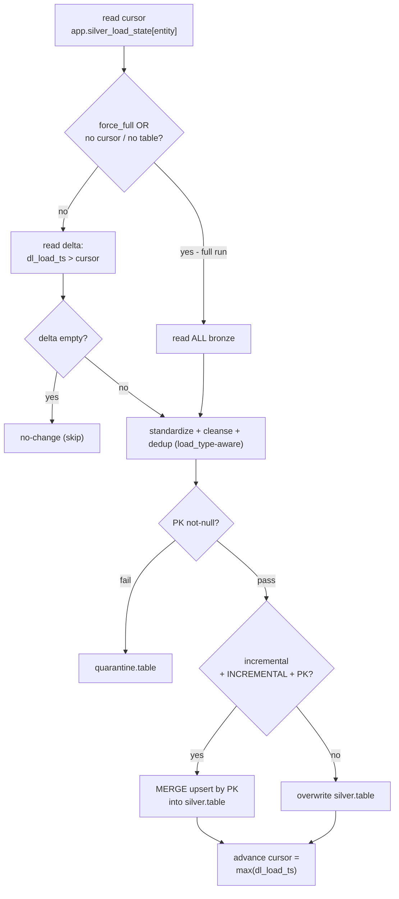

**Delete handling:** soft deletes propagate live (source `deleted_ind` flows through the merge); hard deletes are caught by a periodic **full reconcile** (`force_full_all=1`). FULL-load tables are immune (each snapshot is complete).

Current state: first incremental-capable run rebuilds all active tables and seeds the cursor; subsequent runs process only the delta. Silver = the current cleansed view, ready to transform.

### 5.5 Gold — DAG-driven dim/fact builder
The gold layer is a **config-driven DAG**, the most sophisticated part of the framework.

- **`gold_build`** = per-object metadata; **`gold_dependency`** = the edges. The orchestrator computes **topological levels (Kahn)** — independent nodes run in parallel, dependents wait.
- **`nb_gold_orchestrator`** (per level): runs that level's **transform notebooks** in parallel via `mssparkutils.notebook.runMultiple`, then **merges** each into gold by calling the builder.
- **Transform notebooks** (`stageQuery/nb_gold_tf_<obj>`) follow a **standard 5-cell template**: (1) imports+Spark props, (2) derive `stg.<obj>` target from the **notebook's own name** + register sources, (3) drop the stg table, (4) **SparkSQL business logic → DataFrame**, (5) write to the `stg.<obj>` **materialized table**. Naming convention is load-bearing: `nb_gold_tf_<object>` → `stg.<object>`.
- **`nb_util_gold`** (`%run` into the orchestrator) is the engine:
  - `build_dimension(gold_object, source_table, scd_type, surrogate_key, business_keys, non_historized_columns, load_mode)` — SCD1/SCD2; surrogate keys via `row_number()+max_sk` (no IDENTITY); `load_mode='full'` **soft-deletes** source-absent keys (`dl_isdeleted=true`).
  - `build_fact(gold_object, source_table, mode, load_strategy, business_keys, watermark_column, last_n_days)` — `mode` ∈ `reload|append|upsert`; `upsert`+`full` soft-deletes vanished keys.
- **`table_type` × `load_strategy`** (the two columns the orchestrator dispatches on):

  | `table_type` | `load_strategy` | Behaviour |
  |---|---|---|
  | `type1_dimension` | incremental / full | SCD1; `full` soft-deletes absent keys |
  | `type2_dimension` | incremental / full | SCD2 (history); `full` soft-expires absent keys |
  | `append_fact` | (ignored) | insert new business keys only |
  | `upsert_fact` | incremental | merge update+insert, no delete |
  | `upsert_fact` | full | merge **+ soft-delete** absent keys (full sync) |
  | `reload_fact` | (ignored) | full drop+rebuild |

**Gold orchestration (DAG → levels → parallel transforms → merge):**

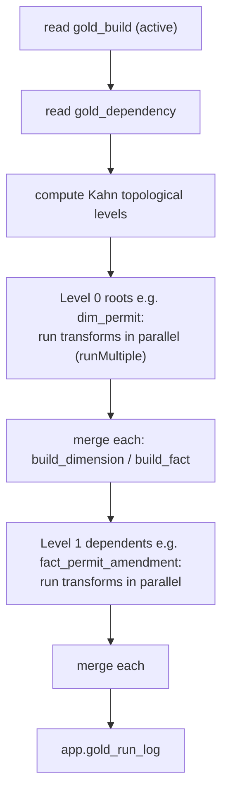

**Standard transform notebook (5-cell template, name-derived target):**

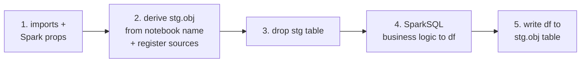

**How `table_type` + `load_strategy` dispatch to the builder:**

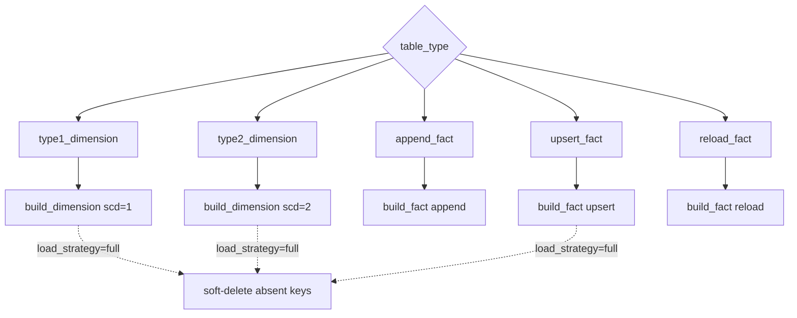

**Dimension row lifecycle (SCD2 + soft delete):**

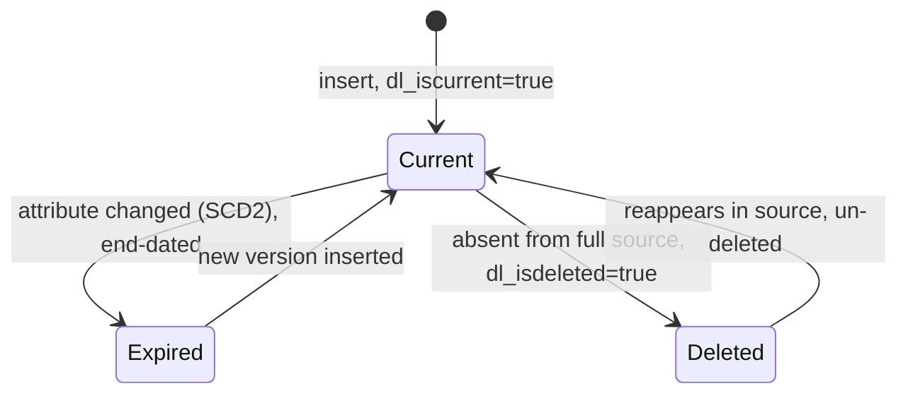

Current state: `dim_permit` (type2/full) and `fact_permit_amendment` (upsert/full) build green; update + soft-delete proven by `nb_gold_test`.

### 5.6 Error logging (centralized)
All notebook failures and (via the `adf-error-log-change.md` handoff) pipeline failures go to **one** `app.error_log`, discriminated by `layer`. One queryable table for the whole platform. `pipeline_log` stays the run-history table; join on `run_id`.

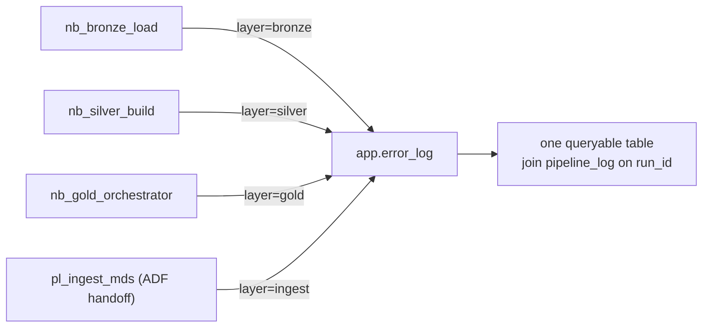

---

## 6. Deployment & run mechanism

**The reusable pattern:** GitHub Actions workflow → SPN `az login` → acquire token → Fabric REST (Items API) to deploy notebooks / run jobs, **or** pyodbc (`run_sql.py`) for warehouse SQL → verify by reading a warehouse table.

- `deploy_notebook.py` — create-or-update a notebook by display name (Items API `updateDefinition`/create, parts = `.platform` + `notebook-content.py` InlineBase64) and optionally **run** it (`jobs/instances?jobType=RunNotebook`, poll). GUIDs are baked into the notebook metadata at deploy time.
- `run_sql.py` — pyodbc + `SQL_COPT_SS_ACCESS_TOKEN`, splits on `GO`. The only way to auth a SPN to the warehouse (F3).

**Workflows (`.github/workflows/`), what each does:**

| Workflow | Action |
|---|---|
| `provision-medallion-lakehouses` | create the 3 schema-enabled lakehouses |
| `deploy-app-tables` | run `app_registry_tables.sql` (control tables + seed) |
| `deploy-notebooks` | deploy foundation (`nb_util_paths`, `nb_smoke_foundation`) + smoke |
| `deploy-run-bronze` | deploy + run `nb_bronze_load`, verify bronze |
| `fabric-ops-clone-catalog` | clone `Metadata_Extractor` → `pl_extract_source_catalog` and run it |
| `fabric-ops-build-registry` | deploy + run `nb_silver_registry` only (fast registry rebuild) + verify |
| `deploy-run-silver` | run `nb_silver_registry` **then** `nb_silver_build`, verify |
| `deploy-run-gold` | deploy gold notebooks + run orchestrator, verify `gold_run_log` |
| `fabric-ops-gold-test` | run `nb_gold_test` (update + soft-delete tests), verify |
| `fabric-ops-adhoc-sql` | run `medallion/sql/adhoc.sql` against the warehouse (scratch queries) |
| `fabric-ops-list-tables` | list lakehouse tables via OneLake DFS (bypasses SQL-endpoint lag) |
| `fabric-ops-organize-folders` | mirror repo folders into the workspace UI |
| `fabric-ops-probe-pipeline` | read-only inspect Fabric pipelines/connections |
| `fabric-ops-delete-workspace` | delete an orphan workspace |

Most are **push-path-filtered** on `medallion/**` (editing the relevant file auto-runs it) and also `workflow_dispatch`.

---

## 7. RUNBOOK — how to operate

> All runs happen via GitHub Actions (you cannot `az login` interactively). Either **push** the relevant file on a `medallion/**` branch, or **dispatch** the workflow: `gh workflow run <name>.yml --ref <branch>`. Read results from the run log or by querying the warehouse (`fabric-ops-adhoc-sql`).

### 7.1 Full refresh, end to end

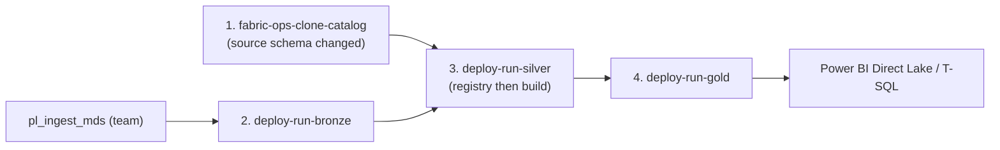

1. **Source catalog** (only when the source schema changed): dispatch `fabric-ops-clone-catalog` → lands `mds_source_catalog`.
2. **Bronze**: `deploy-run-bronze` (loads new raw files; append-only/idempotent).
3. **Registry + Silver**: `deploy-run-silver` (rebuilds registries from the catalog, then builds all active silver tables).
4. **Gold**: `deploy-run-gold` (builds the dim/fact DAG).

### 7.2 Add a new SOURCE table to silver — *nothing to code*
It's automatic: once the table is in `pipeline_control` **and** has landed in bronze, the next `nb_silver_registry` run registers it `is_active=1` and `nb_silver_build` builds `silver.<table>`. To rebuild the registry quickly without the full silver build, dispatch **`fabric-ops-build-registry`**.

### 7.2a Force a full silver reconcile (hard-deletes / drift)
Silver is incremental. To rebuild **every** active table from all bronze history (catches source hard-deletes and corrects any drift), set the flag and run silver:
```sql
UPDATE app.silver_settings SET force_full_all = 1, updated_date = SYSUTCDATETIME();
```
(via `fabric-ops-adhoc-sql`), then dispatch `deploy-run-silver`. The notebook does a full rebuild and **self-resets** the flag to 0. Recommended cadence: weekly, or after a known source purge.

### 7.3 Activate the parked (unlanded) tables — e.g. `mine`
No action needed in our code. When the ingestion team lands the table in bronze, re-run `fabric-ops-build-registry` (or `deploy-run-silver`). The registry's landed-check flips it `is_active=1` automatically, with the correct source PK already known. (To force a table on/off manually, you would override `object_registry.is_active`, but note the next registry rebuild re-derives it from the landed check.)

### 7.4 Add a new GOLD dimension or fact
1. **Create a transform notebook** in `Fabric/Notebook/stageQuery/nb_gold_tf_<object>.Notebook` by **copying `nb_gold_tf_dim_permit`** and editing only cell 4 (the SparkSQL business logic) and the source view registration in cell 2. Keep the `nb_gold_tf_` prefix — the target `stg.<object>` is derived from the name.
2. **Seed `gold_build`** (one row): `gold_object`, `object_type`, `transform_notebook`, `source_table='stg.<object>'`, `table_type`, `load_strategy`, `surrogate_key` (dims), `business_keys`, etc.
3. **Seed `gold_dependency`**: `node_name` + `depends_on` (e.g. a fact depends on its dims so SK lookups resolve).
4. Add the notebook to `run_gold.sh`'s deploy list and the `deploy-run-gold` path filter; add it to `organize_folders.py` `LAYOUT["stageQuery"]`.
5. Dispatch `deploy-run-gold`; verify via `gold_run_log`.

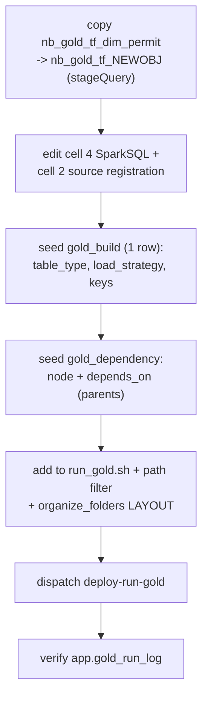

### 7.5 Verify / inspect
- **Ad-hoc SQL:** edit `medallion/sql/adhoc.sql`, push (or dispatch `fabric-ops-adhoc-sql`); results print in the run log.
- **What tables exist (no SQL lag):** `fabric-ops-list-tables` (OneLake DFS listing).
- **Gold outcome:** `app.gold_run_log`. **Silver outcome:** `app.silver_run_log`. **Errors:** `app.error_log WHERE layer=...`.

### 7.6 Test the gold builder
Dispatch `fabric-ops-gold-test`: it mutates `stg` (update + delete rows), runs the builders, asserts the gold outcome (SCD2 new version, tombstones), then **restores** gold. Results in `app.gold_test_log`.

### 7.7 Troubleshooting — hard-won findings (full list in WORKLOG)
| Symptom | Cause / fix |
|---|---|
| Notebook stdout not retrievable | **F9** — Fabric job stdout isn't exposed via API. Write outcomes to a warehouse table and read via SQL. Portal cell-output is the only place to see a raw cell error. |
| Lakehouse SQL endpoint shows stale/missing tables | SQL-endpoint **sync lag**. Use OneLake DFS listing (`fabric-ops-list-tables`) or the **warehouse** (no lag). |
| `synapsesql` write writes 0 rows | **F10** — needs `from com.microsoft.spark.fabric import Constants` to register the writer. |
| `%run` magic error | **F11** — `%run` must be **alone** in its cell (no comments/code). |
| `WRITE_ANCIENT_DATETIME` | **F12** — pre-1900 dates need `spark.sql.parquet.{datetime,int96}RebaseMode{InWrite,InRead}=LEGACY`. |
| `SCHEMA_NOT_FOUND` on saveAsTable | **F8** — `CREATE SCHEMA IF NOT EXISTS` first (schema-enabled lakehouses don't auto-create). |
| `CREATE TABLE` rejects IDENTITY/PK | **F1/F2** — Fabric Warehouse limitation; mint keys in the writer. |
| SPN can't auth to warehouse with sqlcmd | **F3** — use `run_sql.py` (pyodbc + access token). |

---

## 8. Testing strategy
- **`nb_gold_test`** — black-box test of `build_dimension`/`build_fact`: purposely changes column values and deletes rows in `stg`, runs the builders, asserts update + soft-delete outcomes, restores gold. Re-runnable; results in `app.gold_test_log`.
- **`nb_smoke_foundation`** — validates cross-lakehouse OneLake read/write as the SPN.
- **Gap:** there is **no unit-test harness for the Spark logic** yet. The accelerator pattern (`src/mxfabric/*.py` + pytest + local Spark, notebooks consume via `%run`) is the intended path — see §9.

---

## 9. Where to improve (roadmap for the new engineer)

**High value / near-term**
1. **Data-quality engine** — `dq_rule`/`dq_result` tables exist but are unused. Implement a registry-driven DQ pass in silver (not_null, unique, range, regex, allowed_values, referential, freshness) writing `dq_result`. Today silver only does not-null-PK + quarantine.
2. **Land `mine` and the ~29 parked business tables** — coordinate with the ingestion owner (they're in `pipeline_control` but not in `Files/raw`). `mine` is the hub blocking `dim_mine` and most facts. Already auto-activates once landed.
3. **Source views** — the catalog query is base tables only (`relkind IN ('r','p')`). Add `'v'` in `clone_source_catalog.py` if view-backed entities (e.g. `*_view`) are needed in silver.
4. **Incremental silver** — silver is currently full-overwrite per run. For large/slow tables, move to merge-on-PK using the watermark already in the registry.

**Engineering hardening**
5. **Unit tests** — extract the Spark logic into `src/mxfabric/*.py`, test with pytest + local Spark, keep notebooks `%run`-synced (drift-guard). Open the wheel path (build once, attach to the Spark environment) instead of `%run`.
6. **Parallelism in silver** — 210 tables run sequentially (~34 min). Batch by `priority`/`load_group` and use `runMultiple`, or partition the loop.
7. **Notebook-stdout observability** — standardize on per-run warehouse log tables (done for gold/silver) for everything; consider structured run summaries.
8. **Secrets & connections** — our SPN can run pipelines using existing connections; document/confirm which connections it may use, and get the source/KV access formally granted if direct JDBC is ever wanted.

**Modeling (see companion doc)**
9. Build out the gold star schema beyond `dim_permit`/`fact_permit_amendment` per the phasing in `02-SOURCE-DATA-and-GOLD-MODEL.md`.
10. **Semantic model + serving** — Direct Lake model over gold; role-playing date/party; PII masking in serving views.

---

## 10. Glossary of the moving parts (quick reference)
- **stg.<obj>** — materialized staging table a transform notebook produces; the orchestrator merges it into gold.
- **load_type** (ingestion) vs **load_strategy** (gold) — `load_type` (FULL/INCREMENTAL) is how the *source* is ingested (drives silver dedup); `load_strategy` (incremental/full) is how a *gold* object handles deletes.
- **soft delete** — `dl_isdeleted=true` (+ `dl_iscurrent=false` for dims); rows retained for audit, hidden by serving filters.
- **role-playing** — one physical dim (date, party) exposed as several views (submitted/received date; inspector roles).
- **F-numbers** (F1–F12) — empirically-discovered Fabric constraints, catalogued in `WORKLOG.md`.
