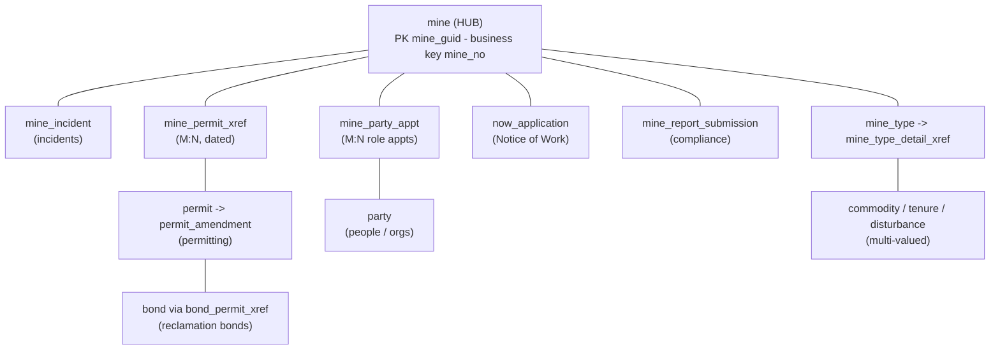
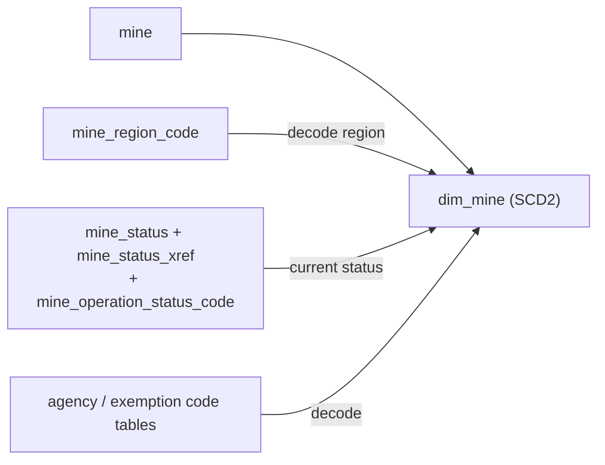
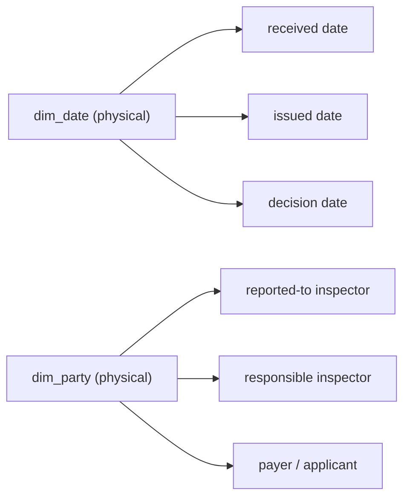
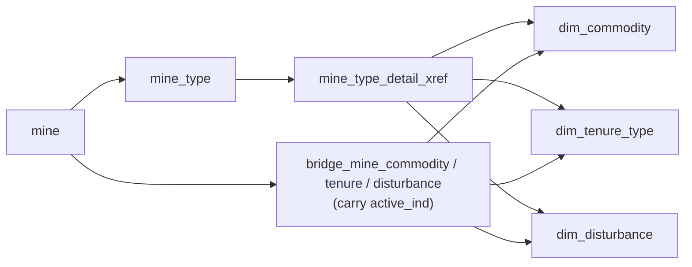
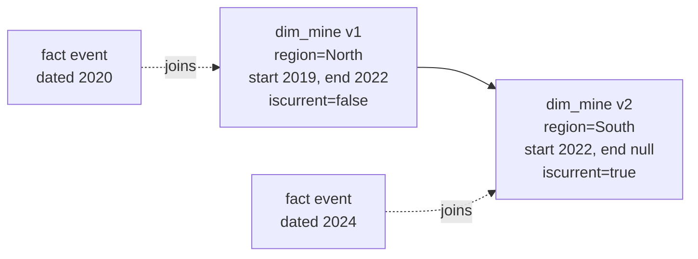
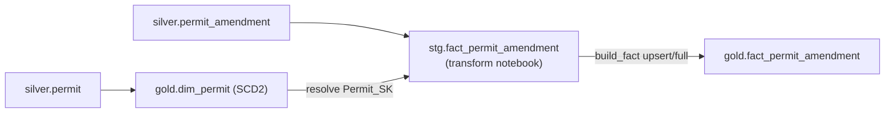
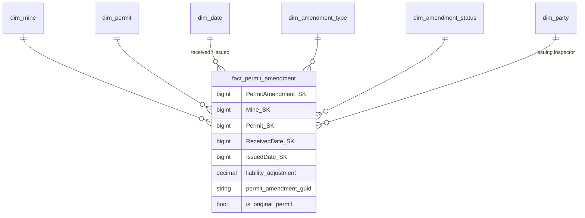
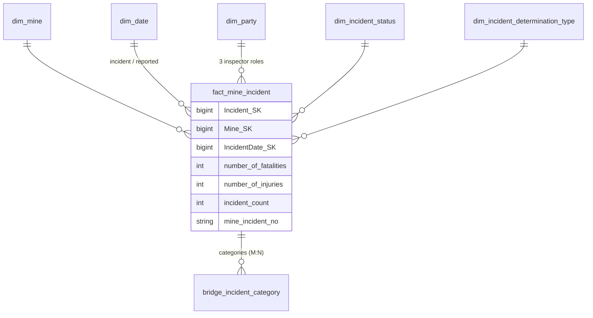
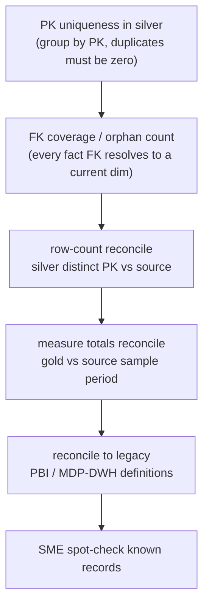
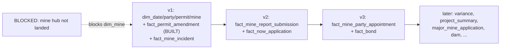

# Mines Data Platform — Source Data Findings + Proposed Gold Star Schema

> **Audience:** the onboarding data engineer (and analytics stakeholders).
> **Purpose:** what we know about the **MDS** source (`public` schema), the proposed **dimensional model**, exactly **which source table(s)** feed each dimension/fact, the **rationale**, and how to **validate** the design before/after building.
> **Companion:** `01-ELT-FRAMEWORK-design-and-runbook.md` (how the platform is built/run).
> **Provenance:** source structure was analysed via the **SchemaSpy** render (`https://mds-schemaspy-test.apps.silver.devops.gov.bc.ca/public/index.html`) and is now **machine-confirmed** by our `field_registry`/`object_registry` (built from the live source `pg_catalog` — true PKs, real types). Where SchemaSpy (a possibly-stale TEST render) and the registry disagree, **trust the registry**.

---

## 1. Source overview

**MDS** (Mines Digital Services) is BC's operational mines-regulation system. Source = PostgreSQL 16, connection `mcm-mdscore-postgresql-dev`. The `public` schema has **354 base tables** (our `object_registry` count; SchemaSpy reported ~252 — the registry is authoritative and live). Of those, **210 have landed in bronze and are built into silver**; the rest are unlanded or operational.

**Explore the source from the registry (no source access needed):**
```sql
-- every source table + its TRUE primary key (composite shown comma-separated)
SELECT bronze_table, primary_key, load_type, is_active FROM app.object_registry ORDER BY bronze_table;
-- every column of a table, with real source type + PK flag
SELECT column_name, spark_type, nullable, is_pk, ordinal
FROM app.field_registry WHERE entity = 'mine' ORDER BY ordinal;
-- find candidate fact/dimension tables (those with date/measure columns, code tables, xrefs)
SELECT entity, column_name, spark_type FROM app.field_registry
WHERE column_name LIKE '%_id' OR column_name LIKE '%_code' OR column_name LIKE '%_guid';
```

### 1.1 What's signal vs noise
**Ignore** (operational / system, auto-marked `is_active=0`): `etl_*`, `tmp*`, `celery_*`, `flyway_*`/migrations, `django_*`, `auth_*`, `spatial_ref_sys`, Metabase/test views.
**Analytical core** centres on the **`mine`** hub and these regulatory processes: **incidents, permitting & amendments, Notice-of-Work (NoW) applications, report/compliance submissions, party/role appointments, reclamation bonds**.

### 1.2 Key structural facts (confirmed)
- **`mine`** PK `mine_guid` (uuid); business key `mine_no`; region via `mine.mine_region → mine_region_code`. **Currently NOT landed in bronze** — registered inactive; it is the hub blocking `dim_mine` and most facts. **This is the #1 gap to resolve with the ingestion owner.**
- Mine **tenure / commodity / disturbance** are **multi-valued** via `mine → mine_type → mine_type_detail_xref` → require **bridge** tables, not scalar FKs.
- **`permit_amendment`** is the permit-event grain (the original permit is its first amendment). `mine_permit_xref` is a **time-bounded M:N** bridge between mine and permit.
- **`mine_party_appt`** is the **M:N, date-bounded, role-typed** bridge between `party` and `mine`.
- **`mine_incident`**, **`now_application`**, **`mine_report_submission`** are clean event tables with measures and multiple milestone dates.
- **Composite primary keys are real and now known** (from `pg_catalog`) — e.g. `bond_permit_xref`=(`bond_id,permit_id`), `mine_incident_category_xref`=(`mine_incident_id,mine_incident_category_code`), `activity_summary_building_detail_xref`=(`activity_summary_id,activity_detail_id`). Earlier guesses (single FK as "primary key" from `pipeline_control`) were **wrong**; the registry now drives correct dedup/joins.

### 1.3 The source domain — `mine` is the hub



---

## 2. Proposed gold star schema

### 2.1 Bus matrix (conformed dimensions × facts)

| Fact (grain) | dim_date | dim_mine | dim_party | dim_permit | local / bridge dims |
|---|:--:|:--:|:--:|:--:|---|
| **fact_permit_amendment** (1 amendment) ✅ built | ✔ received/issued/auth-end | ✔ | ✔ issuing inspector | ✔ | amendment_type, amendment_status |
| **fact_mine_incident** (1 incident) | ✔ incident/reported | ✔ | ✔ reported-to / responsible / determination inspector | – | incident_status, determination_type; **bridge** incident_category |
| **fact_now_application** (1 NoW app, accumulating snapshot) | ✔ submitted/received/verified/decided | ✔ | ✔ lead/issuing inspector | – | now_type, now_status, source_type |
| **fact_mine_report_submission** (1 submission) | ✔ due/received | ✔ | – (submitter free-text) | ✔ | report_definition, submission_status |
| **fact_mine_party_appointment** (1 appointment, factless) | ✔ start/end | ✔ | ✔ | ✔ optional | party_role |
| **fact_bond** (1 bond) | ✔ issue/closed | – via permit xref | ✔ payer | ✔ via bond_permit_xref | bond_type, bond_status |

✅ = built today. The rest are designed and phased (§5).

### 2.2 Conformed dimensions

**dim_mine — SCD Type 2.** Source `mine` (+ decode region/agency/exemption codes; current operational status via `mine_status → mine_status_xref → mine_operation_status_code`). History matters (region reassignment, major-mine status, employee counts, operational status). Key attrs: `mine_guid`/`mine_no` (business keys), `mine_name`, flags (`major_mine_ind`, `union_ind`, `ohsc_ind`), `region_code/desc` (decoded), lat/long, employee/contractor counts (SCD2-tracked), agency type, exemption status, current operation status, `deleted_ind` (kept for audit, filtered in serving).

**dim_party — SCD Type 2, role-playing.** Source `party`. People + organizations; self-references for `organization_guid` (hierarchy) and `merged_party_guid` (survivorship). Plays many roles across facts (inspectors, payer, applicant) → exposed as **role-playing views** (`dim_inspector`, etc.). Attrs: `party_guid`, names, `party_type` (decoded), job title, email/phone (**PII — tag in `field_registry.pii_type`, mask in serving**), org link. Address is 1:M from party → SCD attributes or a `dim_address` mini-dimension.

**dim_permit — SCD Type 2.** Source `permit` (+ status decode). `permit_guid`, `permit_no`, `project_id`, `is_exploration`, current status, `remaining_static_liability` (current-state measure). Mine relationship via `mine_permit_xref` (M:N, dated) — resolve the active mine at event time on the fact, or bridge.

**dim_date — static conformed calendar.** Generated (1900–2100 or source min/max), day grain, standard attrs. Role-played across every milestone date.

**Code/lookup dimensions — SCD Type 1** (tiny, overwrite): `dim_incident_status`, `dim_incident_determination_type`, `dim_amendment_type`, `dim_amendment_status`, `dim_now_type`, `dim_now_status`, `dim_application_source_type`, `dim_report_definition`, `dim_report_submission_status`, `dim_bond_type`, `dim_bond_status`, `dim_party_role`. Each: `{Dim}_SK, code, description, display_order, active_ind`. Tiny flag combos may collapse into per-fact **junk dimensions**.

**Bridges (multi-valued):** `bridge_mine_commodity` / `bridge_mine_tenure` / `bridge_mine_disturbance` (resolve `mine → mine_type → mine_type_detail_xref → {commodity, tenure, disturbance}`), `bridge_incident_category` (`mine_incident_category_xref`, hierarchical `mine_incident_category`).

**dim_mine sourcing (one entity, several decodes):**



**Role-playing dimensions (one physical table, many roles):**



**Multi-valued bridges (never flatten into the fact):**



### 2.3 Surrogate keys & SCD strategy
- **Surrogate keys:** `{Entity}_SK BIGINT` via `row_number()+max_sk` (no IDENTITY in Fabric). Natural keys retained.
- **SCD:** dim_mine / dim_party / dim_permit → **Type 2**; code/lookup → **Type 1**; dim_date → static. Type-2 carry `dl_iscurrent`, `dl_recordstartdateutc`, `dl_recordenddateutc`; facts join the version current at event date.
- **Soft delete:** in the built framework, `full` load_strategy soft-deletes source-absent keys (`dl_isdeleted=true`).
- **Role-playing:** dim_date / dim_party are single physical tables exposed as multiple role views.

**SCD Type 2 over time (how a fact joins the version current at event date):**



---

## 3. Source-to-target mapping (which source tables flow into each gold object, and why)

| Gold object | Type / SCD | Primary source table(s) | Combined / decoded with | Grain & rationale |
|---|---|---|---|---|
| **dim_mine** | dim / SCD2 | `mine` | `mine_region_code` (region), `mine_status`+`mine_status_xref`+`mine_operation_status_code` (current status), agency/exemption code tables | 1 row per mine version. Hub of the model; history needed. **Blocked: `mine` not yet landed.** |
| **dim_party** | dim / SCD2, role-playing | `party` | self-joins (`organization_guid`, `merged_party_guid`); `address` (mini-dim or SCD attrs); party-type code | 1 row per party version. Reused as inspector/payer/applicant roles. |
| **dim_permit** | dim / SCD2 | `permit` | permit-status code; `mine_permit_xref` for mine linkage | 1 row per permit version. |
| **dim_date** | dim / static | generated | – | 1 row per day. Role-played across all milestone dates. |
| **dim_*(codes)** | dim / SCD1 | the respective `*_code` lookup tables | – | 1 row per code value. |
| **bridge_mine_commodity / tenure / disturbance** | bridge | `mine_type` + `mine_type_detail_xref` | `*_code` dims for the leaf | resolves M:N mine↔{commodity,tenure,disturbance}; carry `active_ind`. |
| **bridge_incident_category** | bridge | `mine_incident_category_xref` (composite PK) | `mine_incident_category` (self-referencing hierarchy) | M:N incident↔category; flatten the ragged hierarchy. |
| **fact_permit_amendment** ✅ | fact / transaction | `permit_amendment` | join `gold.dim_permit` for `Permit_SK`; (later) `dim_mine`, `dim_amendment_*`, issuing inspector via `party` | 1 row per amendment. Measure `liability_adjustment`; degenerate `permit_amendment_guid`; `is_original_permit` from amendment sequence. **Built.** |
| **fact_mine_incident** | fact / transaction | `mine_incident` | `dim_mine`, `dim_party` (3 inspector roles), `dim_incident_status`, `dim_incident_determination_type`, `bridge_incident_category`; dates | 1 row per reported incident. Measures: fatalities, injuries, incident_count=1. **Normalize timestamps to UTC in silver** (`incident_timezone`/`tz_legacy`). |
| **fact_now_application** | fact / accumulating snapshot | `now_application` | mine via `now_application_identity`; `dim_now_*`, `dim_application_source_type`, inspector roles; milestone dates | 1 row per NoW app; lag measures (e.g. `days_submit_to_decision`) computed in silver/gold. |
| **fact_mine_report_submission** | fact / transaction | `mine_report_submission` | `dim_mine`, `dim_permit`, `dim_report_definition`, `dim_report_submission_status`; due/received dates | 1 row per submission/revision. Lateness analytics: `days_late`, `is_on_time`, `is_latest`. |
| **fact_mine_party_appointment** | factless fact | `mine_party_appt` | `dim_mine`, `dim_party`, `dim_party_role` (`mine_party_appt_type_code`), `dim_date` (start/end), optional `dim_permit` | 1 row per appointment (mine×party×role×window). "Who held role R at mine M on date D". |
| **fact_bond** | fact / transaction | `bond` | `bond_permit_xref` (composite PK `bond_id,permit_id`) → permit → mine; `dim_party` (payer), `dim_bond_*`, dates | 1 row per bond. Measure `amount`. |

**Lineage of the one built fact (silver → stg → gold):**



**fact_permit_amendment star (built):**



**fact_mine_incident star (next, v1):**



**Why these source tables specifically:** each fact maps to exactly one **event/transaction table** that already carries its measures and milestone dates at the desired grain (`permit_amendment`, `mine_incident`, `now_application`, `mine_report_submission`, `mine_party_appt`, `bond`). Dimensions map to the **entity/reference** tables (`mine`, `party`, `permit`, `*_code`). Multi-valued relationships (commodity/tenure/disturbance, incident category, bond↔permit) are **xref tables with composite PKs** → modeled as bridges, never flattened into the fact (would multiply grain).

---

## 4. How to VALIDATE the design (do this before trusting any gold table)



### 4.1 Structural validation (from the registry — no source access)
1. **PK uniqueness assumption:** for each dimension/fact source, confirm the registry PK is truly unique in silver:
   `SELECT <pk_cols>, COUNT(*) FROM silver.<t> GROUP BY <pk_cols> HAVING COUNT(*)>1;` → must return 0 rows. (The builder also runs a grain-dupes check.)
2. **Composite-PK xrefs:** confirm bridges use the **composite** PK from `object_registry.primary_key` (not a single FK). Spot-check `bond_permit_xref`, `mine_incident_category_xref`.
3. **FK coverage / orphans:** every fact FK must resolve to a current dim row. After building, count unmatched:
   `SELECT COUNT(*) FROM stg.<fact> s LEFT JOIN gold.dim_x d ON s.k=d.nk AND d.dl_iscurrent WHERE d.<SK> IS NULL;` → investigate non-zero (late-arriving dims, bad keys).
4. **Date coverage:** every milestone date in a fact must fall in `dim_date`'s range.

### 4.2 Semantic validation (reconcile to source & to the old models)
5. **Row-count reconciliation:** `count(distinct business_key)` in silver vs the source table's count (via `mds_source_catalog` row counts or a one-off source query through the pipeline). Material gaps = ingestion/dedup issues.
6. **Measure totals:** sum key measures (e.g. `liability_adjustment`, incident counts) in gold vs source for a sample period.
7. **Against the legacy Power BI / MDP-DWH logic** — the old semantic models encode the business's accepted definitions. See `docs/_local/oldmodel/01-logic-inventory.md` (line-level logic), `02-migration-plan.md` (push logic leftward), `03-raw-gap-analysis.md` (raw gaps). **Reconcile each gold measure/flag to its legacy definition**; differences must be explainable.
8. **Soft-delete / SCD behaviour:** `nb_gold_test` already proves update + soft-delete for dim & fact. Extend it per new object.

### 4.3 Business validation
9. Have a subject-matter expert confirm grain and a few known records ("permit X has N amendments", "mine M's region is R") against gold.

---

## 5. Phasing (provisional — confirm with the team)



- **v1 (tracer bullet):** conformed `dim_date`, `dim_party`, `dim_permit`, `dim_mine` + `fact_permit_amendment` (✅ built) + `fact_mine_incident`. Exercises SCD2, role-playing, mine↔permit bridge on the two cleanest high-value facts. **Blocked on `mine` landing for `dim_mine`.**
- **v2:** `fact_mine_report_submission` + `fact_now_application`.
- **v3:** `fact_mine_party_appointment` + `fact_bond`.
- **Later candidates (not modeled yet):** `variance`, `project_summary`, `major_mine_application`, `explosives_permit`, `mine_tailings_storage_facility`, `dam`.

---

## 6. Open questions & assumptions (resolve with stakeholders)

1. **SCD confirmation** — dim_mine/party/permit proposed as Type 2; confirm which truly need history vs Type 1 (per the "decide per-dimension" gate).
2. **mine ↔ permit at event time** — resolve mine via `mine_permit_xref` validity window, or rely on a direct (nullable) `mine_guid` on the event? Confirm per fact.
3. **Region semantics** — `mine_region_code` (used by `mine`) vs `regions.regional_district_id` (used by `project_summary`) are **distinct**; do not conform without a confirmed mapping.
4. **Bonds** — confirm the `bond → bond_permit_xref → permit → mine` path before building `fact_bond`.
5. **Timezones** — incident timestamps carry `incident_timezone`/`tz_legacy`; normalize to UTC (keep original) in silver.
6. **PII** — `party` holds emails/phones/tax numbers; tag `field_registry.pii_type` and mask in non-privileged serving views.
7. **Category hierarchy** — `mine_incident_category` is self-referencing; flatten to a ragged hierarchy or levelized columns.
8. **Source views** — view-backed entities (`*_view`) aren't in the base-table catalog → not in silver today. Decide if any are needed (one-line add in `clone_source_catalog.py`).
9. **The ~144 inactive source tables** — most are unlanded or operational. Decide which of the unlanded **business** tables (esp. `mine`, `MTA_*`, `nris_*`, `now_application_*`, `minespace_*`) must be ingested for the model to complete.

---

## 7. The single most important next step

**Get `mine` (and the other unlanded business tables) landed in bronze.** The entire model hangs off `dim_mine`; it is configured in `pipeline_control` but absent from `Files/raw`. Once it lands, `fabric-ops-build-registry` auto-activates it (correct PK `mine_guid` already known) and silver builds it — then `dim_mine` and the mine-anchored facts can be built with no framework changes.
