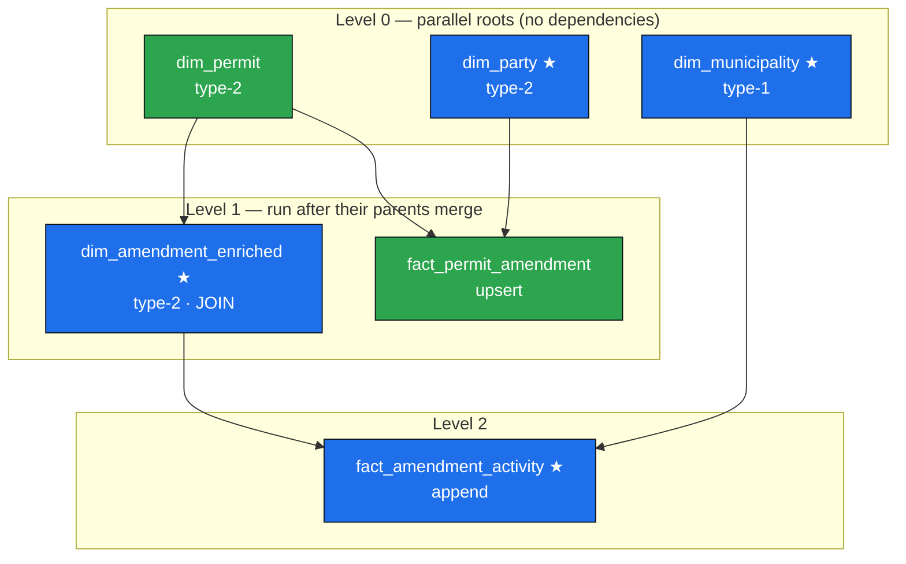
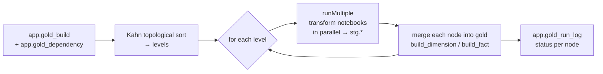

# Demo — Metadata-Driven Gold DAG (technical capability)

> **Purpose:** prove the gold framework can build a real multi-level, multi-parent star-schema
> DAG — parallel roots, dim→dim enrichment, surrogate-key resolution, SCD1/SCD2, fact upsert/append,
> and topological ordering — **entirely from metadata**, with no orchestrator code changes per object.
>
> **Important:** the *business logic here is intentionally artificial* (e.g. a synthetic municipality
> assignment, fake measures). This demo showcases the **engine**, not a business model. The real
> proposed star schema is in [`02-SOURCE-DATA-and-GOLD-MODEL.md`](02-SOURCE-DATA-and-GOLD-MODEL.md).

---

## 1. What was built

Six gold objects across three topological levels. Adding each one was **metadata + one notebook** —
no change to the orchestrator. The four new demo objects are marked **★**.

| Node | Type | `load_strategy` | Demonstrates | Rows (last build) |
|---|---|---|---|---|
| `dim_permit` | type-2 dim | full | existing SCD2 root | 8,610 |
| `dim_party` ★ | **type-2 dim**, single table | full | classic SCD2 (history on change) | 17,198 |
| `dim_municipality` ★ | **type-1 dim**, small ref table | full | SCD1 overwrite-in-place | 222 |
| `dim_amendment_enriched` ★ | **type-2 dim, JOIN** | full | silver⨝silver join **+ dim→dim** surrogate lookup | 24,750 |
| `fact_permit_amendment` | upsert fact | full | MERGE upsert + soft-delete; multi-parent | 24,750 |
| `fact_amendment_activity` ★ | **append fact** | full | **level-2, multi-parent** fan-in from gold dims | 24,750 |

Every object is one row in `app.gold_build` (what/how to build) + one row in `app.gold_dependency`
(its parents). The orchestrator reads both, computes the DAG, and runs it.

---

## 2. The dependency graph



**What the shape proves:**
- **Parallel roots** — `dim_permit`, `dim_party`, `dim_municipality` have no parents → built concurrently in Level 0.
- **dim→dim edge** — `dim_amendment_enriched` resolves `Permit_SK` from the already-built `gold.dim_permit`, so it *must* wait for it.
- **Multi-parent fan-in** — `fact_permit_amendment` needs two dims (`dim_permit`, `dim_party`); `fact_amendment_activity` needs a Level-1 dim **and** a Level-0 dim (`dim_amendment_enriched`, `dim_municipality`) → lands at Level 2.

---

## 3. How the orchestrator turns metadata into this DAG



1. **Read config** — `gold_build` (active nodes) + `gold_dependency` (CSV parent lists).
2. **Level it** — Kahn's algorithm: a node is ready when all its parents are done; independent nodes share a level.
3. **Per level**: run every node's transform notebook in parallel (`mssparkutils.notebook.runMultiple`) to materialize its `stg.<object>` table, **then** merge each into gold.
   - `table_type` → builder + SCD/fact mode: `type1_dimension`→SCD1, `type2_dimension`→SCD2, `append_fact`→append, `upsert_fact`→upsert, `reload_fact`→reload.
   - `load_strategy=full` means the source is a complete snapshot, so absent business keys are **soft-deleted** (dimensions and upsert facts).
4. **Log** every node's outcome to `app.gold_run_log`.

The transform notebooks follow a fixed **5-cell template** (`nb_gold_tf_<object>` → `stg.<object>`):
imports/Spark props → derive target from notebook name + register sources → drop stg → SparkSQL business logic → write. The business cell is the *only* part that changes per object.

---

## 4. Proof it ran in order (last run)

From `app.gold_run_log` / the orchestrator's captured `runMultiple` timestamps:

```
Level 0  →  dim_municipality, dim_party, dim_permit          (parallel)
Level 1  →  dim_amendment_enriched, fact_permit_amendment     (parallel, after L0 merged)
Level 2  →  fact_amendment_activity                           (after L1 merged)

result: dim_amendment_enriched  OK   24,750
result: dim_municipality        OK      222
result: dim_party               OK   17,198
result: dim_permit              OK    8,610
result: fact_amendment_activity OK   24,750
result: fact_permit_amendment   OK   24,750   (upserted)
=> 6/6 OK
```

---

## 5. Live demo script (≈8–10 min)

**Setup:** have the Fabric workspace open (notebooks under `Notebook/stageQuery/`), the warehouse
query editor ready, and this diagram on screen.

1. **Frame it (1 min).** "Adding a star-schema table to gold is *configuration*, not code. Let me show
   a DAG with parallel roots, a join-based dimension, and a two-level fan-in — all driven by two metadata tables."

2. **Show the metadata (2 min).** Run in the warehouse:
   ```sql
   SELECT node_name, table_type, load_strategy, surrogate_key, business_keys
   FROM app.gold_build WHERE is_active = 1 ORDER BY node_name;

   SELECT node_name, depends_on FROM app.gold_dependency ORDER BY node_name;
   ```
   Point at `dim_amendment_enriched` (type-2, depends on `dim_permit`) and
   `fact_amendment_activity` (depends on `dim_amendment_enriched,dim_municipality`).
   "These two tables are the *entire* definition of the graph you see on screen."

3. **Show one transform notebook (2 min).** Open `nb_gold_tf_dim_amendment_enriched`. Walk the 5 cells.
   Highlight the business cell: it joins `silver.permit_amendment ⨝ silver.permit` **and** looks up
   `Permit_SK` from `gold.dim_permit` — "that lookup is *why* it depends on dim_permit; the framework
   guarantees dim_permit is built first."

4. **Run the build (1 min to kick off).** Trigger the gold pipeline (or show the last successful run).
   "One orchestrator run; it sorted the graph, ran each level in parallel, and merged everything."

5. **Show the result (2 min).**
   ```sql
   SELECT node_name, gold_object, status, rows, detail
   FROM app.gold_run_log ORDER BY node_name;            -- 6/6 OK
   ```
   Then prove SCD2 history exists and the join populated the surrogate key:
   ```sql
   -- SCD2: dim_party keeps current + historical versions
   SELECT dl_iscurrent, COUNT(*) FROM gold.dim_party GROUP BY dl_iscurrent;

   -- join-based dim carries the parent permit's surrogate key
   SELECT permit_amendment_id, permit_id, Permit_SK, permit_permit_no
   FROM gold.dim_amendment_enriched WHERE dl_iscurrent = 1 LIMIT 10;

   -- level-2 fact references both parents' surrogate keys
   SELECT Amendment_SK, Municipality_SK, processing_days, amendment_count
   FROM gold.fact_amendment_activity LIMIT 10;
   ```

6. **Land the point (1 min).** "To add a real `dim_mine` tomorrow: write one transform notebook,
   insert one `gold_build` row and its `gold_dependency` edges, deploy. No orchestrator change. The
   same engine that ran this demo runs production."

**If asked "is this real data?":** the *rows* are real silver data; the *municipality assignment and
measures in `fact_amendment_activity` are synthetic* (there's no real amendment↔municipality FK). It
exists to exercise multi-parent ordering, not to mean anything.

---

## 6. Files behind this demo

- Transforms: `Fabric/Notebook/stageQuery/nb_gold_tf_{dim_party,dim_municipality,dim_amendment_enriched,fact_amendment_activity}.Notebook`
- Builder engine: `Fabric/Notebook/utility/nb_util_gold.Notebook` (`build_dimension`, `build_fact`)
- Orchestrator: `Fabric/Notebook/nb_gold_orchestrator.Notebook`
- Metadata seed: `medallion/sql/app_registry_tables.sql` (seed v2 — the demo DAG)
- Deploy: `.github/workflows/deploy-run-gold.yml` + `.github/workflows/scripts/run_gold.sh`
